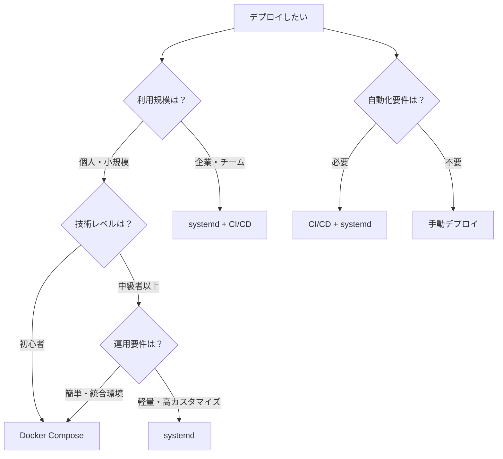

# 本番デプロイ方法の統一ガイド

## 🎯 概要

このガイドは、tobelogの本番環境デプロイメントに関する統一された情報を提供します。複数のデプロイ方法から最適な選択肢を見つけ、段階的にセットアップを行うための総合的なガイドです。

## デプロイ方法の比較

### 📊 方法別比較表

| 方法 | 適用場面 | 難易度 | 特徴 | 推奨度 |
|------|----------|--------|------|--------|
| **Docker Compose** | 個人・小規模 | ★★☆☆☆ | 簡単、統合環境、nginx統合 | ★★★★★ |
| **systemd** | 専用サーバー | ★★★☆☆ | 軽量、カスタマイズ性、詳細運用 | ★★★★☆ |
| **CI/CD** | チーム開発 | ★★★★☆ | 自動化、品質管理、継続的デプロイ | ★★★☆☆ |

### 推奨パターン

- 🏠 **個人ブログ**: Docker Compose + Let's Encrypt
- 🏢 **企業・チーム**: systemd + nginx + CI/CD  
- 🧪 **テスト環境**: Docker Compose (dev設定)

## デプロイ方法の選択



## 🚀 15分クイックスタート

最速で本番環境を構築したい場合は、Docker Composeを使用します。

### 前提条件

- Docker & Docker Compose インストール済み
- ドメイン名取得済み（SSL証明書用）
- Dropbox API トークン取得済み

### 手順

```bash
# 1. リポジトリクローン
git clone <repository-url>
cd tobelog

# 2. 環境変数設定
cp .env.example .env
nano .env  # DROPBOX_ACCESS_TOKEN、ドメイン名を設定

# 3. 本番環境起動
docker-compose -f docker-compose.yml -f docker-compose.production.yml up -d

# 4. SSL証明書自動取得確認
docker-compose logs nginx

# 5. 動作確認
curl https://your-domain.com/health
```

**15分で完了！** ブラウザで `https://your-domain.com` にアクセスして動作確認してください。

## 📚 段階的セットアップ

より確実で理解しながら進めたい場合の段階的アプローチです。

### Stage 1: 基本動作確認（5分）

```bash
# ローカル環境での動作確認
docker-compose up
# http://localhost:3000 で動作確認
```

### Stage 2: 本番環境セットアップ（30分）

```bash
# 本番環境設定
docker-compose -f docker-compose.yml -f docker-compose.production.yml up -d

# SSL証明書設定（Let's Encrypt）
# nginx設定ファイルでドメイン名を確認・更新
# セキュリティ強化設定の確認
```

### Stage 3: 運用設定（60分）

```bash
# 監視設定
# バックアップ設定
# ログ管理設定
# パフォーマンス最適化
```

## 👥 読者層別ガイド

### 初心者向け
**推奨**: Docker Compose一発セットアップ
- [15分クイックスタート](#15分クイックスタート)を実行
- 詳細は [DOCKER.md](DOCKER.md) を参照

### 中級者向け
**推奨**: カスタム設定とセキュリティ強化
- Docker Composeまたはsystemdから選択します
- 詳細は [DOCKER.md](DOCKER.md) または [SYSTEMD.md](SYSTEMD.md) を参照

### 上級者向け
**推奨**: 大規模環境・高可用性構成
- systemd + CI/CD + カスタム監視
- 詳細は [SYSTEMD.md](SYSTEMD.md) および CI/CD設定を参照

## 環境別詳細ガイド

### 個人ブログ環境

**推奨構成**: Docker Compose + Let's Encrypt

```bash
# 最小構成でのデプロイ
docker-compose -f docker-compose.yml -f docker-compose.production.yml up -d
```

**特徴**:
- SSL証明書自動取得・更新
- nginx統合
- リソース最適化

### 小規模チーム環境

**推奨構成**: systemd + nginx + 基本監視

```bash
# systemdサービス化
sudo ./scripts/install-systemd.sh
sudo systemctl enable tobelog
sudo systemctl start tobelog
```

**特徴**:
- 軽量な運用
- 詳細なログ管理
- カスタマイズ性

### 企業環境

**推奨構成**: systemd + CI/CD + 高度な監視

**特徴**:
- 自動デプロイ
- 品質管理
- 高可用性設定

## 🔧 トラブルシューティング

### よくある問題

#### 1. SSL証明書の問題
```bash
# Let's Encrypt証明書の状態確認
docker-compose exec nginx certbot certificates

# 証明書の手動更新
docker-compose exec nginx certbot renew
```

#### 2. Dropbox API接続エラー
```bash
# API接続テスト
curl -H "Authorization: Bearer YOUR_TOKEN" \
  https://api.dropboxapi.com/2/users/get_current_account
```

#### 3. データベース接続問題
```bash
# Docker環境でのデータベース確認
docker-compose exec tobelog sqlite3 /home/app/data/blog.db ".tables"

# systemd環境でのデータベース確認
sudo -u tobelog sqlite3 /var/lib/tobelog/database/blog.db ".tables"
```

### 症状別解決方法

| 症状 | 原因 | 解決方法 |
|------|------|----------|
| サービス起動しない | 環境変数未設定 | `.env`ファイル確認 |
| SSL証明書エラー | ドメイン設定問題 | nginx設定とDNS確認 |
| 502 Bad Gateway | アプリケーション停止 | サービス状態確認 |
| データベースエラー | ファイル権限問題 | 権限設定確認 |

## 🔄 運用・保守

### ログ確認方法

```bash
# Docker環境
docker-compose logs -f tobelog

# systemd環境  
sudo journalctl -u tobelog -f
```

### バックアップ手順

```bash
# Docker環境
docker run --rm -v tobelog-blog-data:/data \
  -v $(pwd):/backup alpine \
  tar czf /backup/blog-data-backup.tar.gz /data

# systemd環境
./scripts/backup.sh --compress --retention 30
```

### アップデート手順

```bash
# Docker環境
git pull origin main
docker-compose -f docker-compose.yml -f docker-compose.production.yml down
docker-compose -f docker-compose.yml -f docker-compose.production.yml up -d --build

# systemd環境
sudo systemctl stop tobelog
cargo build --release
sudo cp target/release/tobelog /usr/local/bin/
sudo systemctl start tobelog
```

## 詳細ドキュメント

各デプロイ方法の詳細については、以下のドキュメントを参照してください：

- **[DOCKER.md](DOCKER.md)**: Docker環境の詳細設定・運用
- **[SYSTEMD.md](SYSTEMD.md)**: systemdサービスの詳細運用
- **[DEVELOPMENT.md](DEVELOPMENT.md)**: 開発環境セットアップ

## 🔗 関連リソース

- [Docker Best Practices](https://docs.docker.com/develop/dev-best-practices/)
- [systemd Service Management](https://www.freedesktop.org/software/systemd/man/systemd.service.html)
- [Let's Encrypt Documentation](https://letsencrypt.org/docs/)
- [nginx Configuration Guide](https://nginx.org/en/docs/)

## 📞 サポート

問題が発生した場合：

1. [トラブルシューティング](#トラブルシューティング)セクションを確認
2. 該当する詳細ドキュメント（DOCKER.md、SYSTEMD.md）を参照
3. [GitHub Issues](https://github.com/junichiro/tobelog/issues)で質問・報告

---

**tobelog** - 効率的で安全な個人ブログシステム