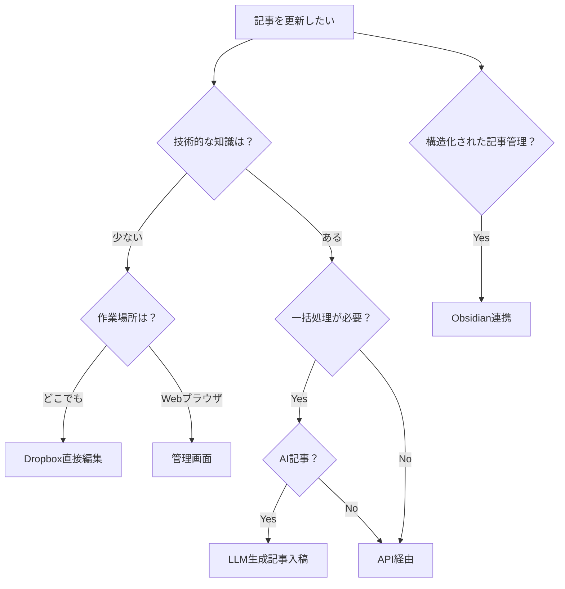
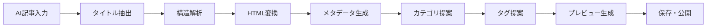

# tobelog - 個人ブログシステム

Dropboxをメインストレージとして活用する、Rust製の個人ブログシステムです。

## 目次

1. [概要](#概要)
2. [記事更新方法](#記事更新方法)
3. [セットアップ](#セットアップ)
4. [トラブルシューティング](#トラブルシューティング)
5. [開発者向け情報](#開発者向け情報)

## 概要

tobelogは、Dropboxをメインストレージとして使用し、複数の記事更新方法を提供する個人ブログシステムです。Markdownファイルを使用して記事を管理し、レスポンシブなWebインターフェースを提供します。

## 記事更新方法

本システムでは以下の5つの記事更新方法を提供しています。用途に応じて最適な方法を選択してください。

### 📊 方法別比較表

| 方法 | 技術レベル | 作業場所 | 一括処理 | オフライン | 推奨用途 |
|------|------------|----------|----------|------------|----------|
| **Dropbox直接編集** | 低 | どこでも | ❌ | ⚠️ | 日常的な記事編集 |
| **管理画面（Admin UI）** | 低 | Webブラウザ | ❌ | ❌ | 簡単な記事作成・編集 |
| **API経由** | 高 | 任意 | ✅ | ✅ | 自動化・外部ツール連携 |
| **LLM生成記事入稿** | 中 | Webブラウザ | ✅ | ❌ | AI記事の一括処理 |
| **Obsidian連携** | 中 | Obsidian | ❌ | ✅ | 構造化された記事管理 |

### 🤔 どの方法を選ぶべきか？



---

## 1. Dropbox直接編集

**最も簡単で直感的な方法**

### 特徴
- ✅ **簡単**: テキストエディタで直接編集
- ✅ **どこでも**: Dropboxがあればどこでも編集可能
- ✅ **自動同期**: 保存と同時に自動で反映
- ❌ **一括処理不可**: 1記事ずつの編集
- ❌ **プレビュー不可**: 編集中の見た目確認ができない

### 使用場面
- 日常的な記事の執筆・編集
- 外出先での記事修正
- 画像を含む記事の作成

### 📁 フォルダ構造
```
/BlogStorage/
├── /posts/                    # 公開記事
│   ├── /2024/                 # 年別フォルダ
│   │   ├── my-first-post.md   # 記事ファイル
│   │   └── my-second-post.md
│   └── /2025/
│       └── new-year-post.md
├── /media/                    # メディアファイル
│   ├── /images/
│   │   ├── /2024/
│   │   │   ├── screenshot1.png
│   │   │   └── diagram.jpg
│   │   └── /2025/
│   └── /videos/
└── /drafts/                   # 下書き
    └── work-in-progress.md
```

### 📝 記事ファイルの形式

#### 基本的なMarkdown記事
```markdown
---
title: "記事のタイトル"
category: "tech"
tags: ["rust", "web", "blog"]
published: true
featured: false
author: "Your Name"
created_at: "2024-01-01T00:00:00Z"
updated_at: "2024-01-01T00:00:00Z"
---

# 記事のタイトル

ここに記事の内容を書きます。

## 見出し2

本文の内容...

### 見出し3

詳細な内容...


```

#### メタデータの詳細説明

| フィールド | 必須 | 説明 | 例 |
|-----------|------|------|-----|
| `title` | ✅ | 記事のタイトル | "Rustでブログを作る方法" |
| `category` | ❌ | カテゴリ（1つのみ） | "tech", "life", "review" |
| `tags` | ❌ | タグのリスト | ["rust", "web", "tutorial"] |
| `published` | ❌ | 公開状態（デフォルト: false） | true, false |
| `featured` | ❌ | 注目記事（デフォルト: false） | true, false |
| `author` | ❌ | 著者名 | "Your Name" |
| `created_at` | ❌ | 作成日時（ISO 8601形式） | "2024-01-01T00:00:00Z" |
| `updated_at` | ❌ | 更新日時（ISO 8601形式） | "2024-01-01T00:00:00Z" |

### 🖼️ 画像の配置方法

1. **画像をアップロード**
   ```
   /media/images/2024/my-image.jpg
   ```

2. **記事内で参照**
   ```markdown
   
   ```

3. **推奨画像形式**
   - **写真**: JPEGまたはWebP
   - **図表**: PNG
   - **アニメーション**: GIF
   - **最大サイズ**: 2MB以下

### ⚠️ 注意点

- **ファイル名**: 半角英数字と`-`（ハイフン）のみ使用
- **拡張子**: `.md`必須
- **文字コード**: UTF-8で保存
- **改行**: LF（Unix形式）推奨
- **同期待機**: 保存後、反映まで最大1分程度

### 🔄 同期タイミング

- **保存時**: Dropboxが自動的にファイルを同期
- **ブログ反映**: 5分毎に自動チェック
- **手動同期**: 管理画面の「同期」ボタンで即座に反映

---

## 2. 管理画面（Admin UI）

**Webブラウザから簡単に記事を管理**

### 特徴
- ✅ **直感的**: フォーム入力で簡単
- ✅ **プレビュー**: リアルタイムでプレビュー表示
- ✅ **メディア管理**: 画像のアップロード・管理
- ❌ **オンライン限定**: インターネット接続必須
- ❌ **一括処理不可**: 1記事ずつの処理

### 使用場面
- 初めての記事作成
- 画像を多用する記事
- Markdownに慣れていない場合

### 🔗 アクセス方法

1. **管理画面URL**
   ```
   http://localhost:3000/admin
   ```

2. **ログイン**
   - 現在は認証なし（開発中）
   - 本番環境では認証機能を追加予定

### 📋 記事作成フロー

#### 1. 新規記事作成
1. 管理画面にアクセス
2. 「新規記事作成」ボタンをクリック
3. 記事情報を入力
4. 「プレビュー」で内容確認
5. 「公開」または「下書き保存」

#### 2. 記事編集
1. 記事一覧から編集したい記事を選択
2. 「編集」ボタンをクリック
3. 内容を修正
4. 「更新」ボタンで保存

#### 3. 画像アップロード
1. 記事編集画面で「画像を追加」
2. ファイルを選択してアップロード
3. 自動的にマークダウン形式で挿入

### 🎯 フォーム項目

| 項目 | 必須 | 説明 |
|------|------|------|
| **タイトル** | ✅ | 記事のタイトル |
| **内容** | ✅ | Markdown形式の本文 |
| **カテゴリ** | ❌ | プルダウンから選択 |
| **タグ** | ❌ | カンマ区切りで入力 |
| **公開状態** | ❌ | チェックボックス |
| **注目記事** | ❌ | チェックボックス |

### 🔍 プレビュー機能

- **リアルタイム**: 入力と同時にプレビュー更新
- **レスポンシブ**: デスクトップ・モバイル表示の確認
- **構文チェック**: Markdownの構文エラーを検出

---

## 3. API経由

**プログラマティックな記事管理**

### 特徴
- ✅ **自動化**: スクリプトでの一括処理
- ✅ **外部連携**: 他システムとの連携
- ✅ **高機能**: 全機能にアクセス可能
- ❌ **技術的**: プログラミング知識が必要
- ❌ **認証**: API Key設定が必要

### 使用場面
- 外部CMSからの移行
- 定期的な記事更新の自動化
- 他システムとの連携

### 🔐 認証方法

#### API Key の設定
```bash
# 環境変数で設定
export TOBELOG_API_KEY="your-api-key-here"

# またはヘッダーで指定
curl -H "Authorization: Bearer your-api-key-here"
```

### 🔗 API エンドポイント

#### 記事操作
```http
# 記事一覧取得
GET /api/posts?page=1&per_page=10&published=true

# 記事詳細取得
GET /api/posts/{slug}

# 記事作成
POST /api/posts
Content-Type: application/json

{
  "title": "新しい記事",
  "content": "記事の内容...",
  "category": "tech",
  "tags": ["rust", "api"],
  "published": true
}

# 記事更新
PUT /api/posts/{slug}
Content-Type: application/json

{
  "title": "更新されたタイトル",
  "content": "更新された内容..."
}

# 記事削除
DELETE /api/posts/{slug}
```

#### 同期・インポート
```http
# Dropbox同期
POST /api/sync/dropbox
Content-Type: application/json

{
  "force": true
}

# Markdown一括インポート
POST /api/import/markdown
Content-Type: application/json

{
  "files": [
    {
      "path": "/posts/2024/new-post.md",
      "content": "# 新しい記事\n\n内容...",
      "metadata": {
        "title": "新しい記事",
        "category": "tech",
        "tags": ["example"]
      }
    }
  ],
  "overwrite": false
}
```

### 📝 リクエスト例

#### curl を使用した例
```bash
# 記事一覧取得
curl -X GET "http://localhost:3000/api/posts?page=1&per_page=5" \
  -H "Authorization: Bearer your-api-key"

# 記事作成
curl -X POST "http://localhost:3000/api/posts" \
  -H "Content-Type: application/json" \
  -H "Authorization: Bearer your-api-key" \
  -d '{
    "title": "API経由で作成した記事",
    "content": "# APIテスト\n\nAPIから記事を作成しました。",
    "category": "tech",
    "tags": ["api", "test"],
    "published": true
  }'
```

#### Python を使用した例
```python
import requests
import json

# 設定
BASE_URL = "http://localhost:3000"
API_KEY = "your-api-key"
headers = {
    "Authorization": f"Bearer {API_KEY}",
    "Content-Type": "application/json"
}

# 記事作成
article_data = {
    "title": "Pythonから作成した記事",
    "content": "# Python API例\n\nPythonスクリプトから記事を作成しました。",
    "category": "tech",
    "tags": ["python", "api"],
    "published": True
}

response = requests.post(
    f"{BASE_URL}/api/posts",
    headers=headers,
    json=article_data
)

if response.status_code == 200:
    print("記事が正常に作成されました")
    print(response.json())
else:
    print(f"エラー: {response.status_code}")
    print(response.text)
```

#### JavaScript を使用した例
```javascript
const BASE_URL = 'http://localhost:3000';
const API_KEY = 'your-api-key';

const headers = {
  'Authorization': `Bearer ${API_KEY}`,
  'Content-Type': 'application/json'
};

// 記事作成
const createArticle = async (articleData) => {
  try {
    const response = await fetch(`${BASE_URL}/api/posts`, {
      method: 'POST',
      headers: headers,
      body: JSON.stringify(articleData)
    });

    if (response.ok) {
      const result = await response.json();
      console.log('記事が作成されました:', result);
      return result;
    } else {
      console.error('エラー:', response.status);
    }
  } catch (error) {
    console.error('ネットワークエラー:', error);
  }
};

// 使用例
createArticle({
  title: 'JavaScriptから作成した記事',
  content: '# JavaScript API例\n\nJavaScriptから記事を作成しました。',
  category: 'tech',
  tags: ['javascript', 'api'],
  published: true
});
```

### 📊 レスポンス形式

#### 成功レスポンス
```json
{
  "success": true,
  "slug": "javascript-api-example",
  "message": "記事が正常に作成されました",
  "post": {
    "id": "550e8400-e29b-41d4-a716-446655440000",
    "slug": "javascript-api-example",
    "title": "JavaScriptから作成した記事",
    "content": "# JavaScript API例\n\nJavaScriptから記事を作成しました。",
    "html_content": "<h1>JavaScript API例</h1><p>JavaScriptから記事を作成しました。</p>",
    "category": "tech",
    "tags": ["javascript", "api"],
    "published": true,
    "featured": false,
    "created_at": "2024-01-01T00:00:00Z",
    "updated_at": "2024-01-01T00:00:00Z"
  }
}
```

#### エラーレスポンス
```json
{
  "error": "validation_failed",
  "message": "タイトルは必須です",
  "code": 400,
  "details": {
    "field": "title",
    "provided": ""
  }
}
```

---

## 4. LLM生成記事入稿

**AI生成記事の効率的な処理**

### 特徴
- ✅ **AI対応**: ChatGPTなどのAI記事を最適化
- ✅ **一括処理**: 複数記事の同時処理
- ✅ **自動整形**: 記事構造の自動調整
- ❌ **品質チェック**: 人間による確認が必要
- ❌ **オンライン限定**: インターネット接続必須

### 使用場面
- ChatGPTで生成した記事の入稿
- 他のAIツールからの記事移行
- 大量の記事を効率的に処理

### 🤖 対応AI・入稿フォーマット

#### ChatGPT/Claude
```markdown
# 記事タイトル

記事の内容...

## 見出し2

内容...
```

#### 記事に含めるべき情報
- **タイトル**: 明確で検索しやすい
- **構造**: 見出し階層を適切に
- **内容**: 具体的で価値のある情報

### 📝 入稿手順

#### 1. 管理画面からの入稿
1. 管理画面 → 「LLM記事インポート」
2. 生成されたテキストを貼り付け
3. タイトル・カテゴリ・タグを確認
4. 「処理開始」ボタンをクリック
5. プレビューで内容確認
6. 「公開」または「下書き保存」

#### 2. API経由での入稿
```bash
curl -X POST "http://localhost:3000/api/import/llm-article" \
  -H "Content-Type: application/json" \
  -H "Authorization: Bearer your-api-key" \
  -d '{
    "content": "# AI記事タイトル\n\nAIが生成した記事内容...",
    "suggested_title": "AI記事タイトル",
    "category_hint": "tech",
    "tags_hint": ["ai", "llm"],
    "source": "chatgpt",
    "published": true
  }'
```

### 🔄 処理フロー



### 🎯 自動処理機能

#### 1. タイトル抽出
- マークダウンヘッダー（`# タイトル`）を検出
- 提案されたタイトルを優先使用
- 最初の段落から自動生成（最大50文字）

#### 2. コンテンツ構造化
- 見出し階層の正規化（最大H3まで）
- 段落の適切な分割
- コードブロックの保護

#### 3. メタデータ生成
- **カテゴリ**: 技術キーワードから自動判定
- **タグ**: 内容から関連キーワードを抽出
- **抜粋**: 最初の段落から200文字
- **スラグ**: タイトルから自動生成

#### 4. 品質チェック
- 重複コンテンツの検出
- 最低文字数の確認
- 不適切なコンテンツの検出

### 🔍 品質チェックポイント

#### 公開前に確認すべき項目
- [ ] **タイトル**: 適切で検索しやすい
- [ ] **構造**: 見出し階層が適切
- [ ] **内容**: 具体的で価値のある情報
- [ ] **カテゴリ**: 適切なカテゴリが選択されている
- [ ] **タグ**: 関連するタグが設定されている
- [ ] **画像**: 必要に応じて画像を追加
- [ ] **リンク**: 外部リンクが適切に設定

### 📊 バッチ処理

#### 複数記事の一括処理
```bash
curl -X POST "http://localhost:3000/api/import/batch" \
  -H "Content-Type: application/json" \
  -H "Authorization: Bearer your-api-key" \
  -d '{
    "articles": [
      {
        "content": "# 記事1\n\n内容...",
        "source": "chatgpt",
        "published": false
      },
      {
        "content": "# 記事2\n\n内容...",
        "source": "claude",
        "published": false
      }
    ]
  }'
```

---

## 5. Obsidian連携

**知識管理システムとの統合**

### 特徴
- ✅ **構造化**: リンクとタグで記事を整理
- ✅ **オフライン**: インターネット不要
- ✅ **高機能**: プラグインで機能拡張
- ❌ **学習コスト**: Obsidianの使い方を覚える必要
- ❌ **設定**: 初期設定が必要

### 使用場面
- 記事間の関連性を管理
- 複雑な記事構造の整理
- 研究・調査記事の作成

### 🔧 セットアップ

#### 1. Obsidianの設定
1. Obsidianをダウンロード・インストール
2. 新しいVaultを作成
3. DropboxフォルダをVaultに設定

#### 2. プラグインの設定
```
推奨プラグイン:
- Templater: テンプレート機能
- Tag Wrangler: タグ管理
- Calendar: カレンダー表示
- Daily Notes: 日記機能
```

#### 3. フォルダ同期の設定
```
Vault設定:
- Vault location: /BlogStorage/
- Templates folder: /templates/
- Attachments folder: /media/images/
```

### 📝 テンプレート活用

#### 記事テンプレート
```markdown
---
title: "{{title}}"
category: "{{category}}"
tags: []
published: false
featured: false
author: "Your Name"
created_at: "{{date}}T{{time}}"
updated_at: "{{date}}T{{time}}"
---

# {{title}}

## 概要

[[関連記事]]

## 本文

### 見出し1

内容...

### 見出し2

内容...

## まとめ

## 参考文献

- [リンク1](URL)
- [リンク2](URL)

## 関連記事

- [[記事1]]
- [[記事2]]

#{{category}} #draft
```

### 🔗 リンク機能

#### 記事間リンク
```markdown
[[他の記事のタイトル]]  # 記事へのリンク
[[記事タイトル|表示名]]  # 表示名を指定
![[記事タイトル]]       # 記事を埋め込み
```

#### タグシステム
```markdown
#tech #rust #web        # 通常のタグ
#tech/rust              # 階層タグ
#tech/rust/web          # 深い階層
```

### 🎯 ワークフロー

#### 記事作成の流れ
1. **アイデア収集**: Daily Notesに記録
2. **構造化**: マインドマップで整理
3. **下書き作成**: テンプレートを使用
4. **リンク追加**: 関連記事をリンク
5. **タグ付け**: 適切なタグを設定
6. **公開**: publishedをtrueに変更

#### 記事管理のベストプラクティス
- **命名規則**: 一貫したファイル名
- **タグ戦略**: 階層的なタグ構造
- **リンク戦略**: 関連記事を積極的にリンク
- **定期見直し**: 古い記事の更新・削除

---

## ❓ よくある質問（FAQ）

### Q1: どの更新方法が一番おすすめですか？
**A:** 用途により異なります：
- **初心者**: Dropbox直接編集
- **Web慣れ**: 管理画面
- **エンジニア**: API経由
- **AI活用**: LLM生成記事入稿
- **知識管理**: Obsidian連携

### Q2: 記事が反映されません
**A:** 以下を確認してください：
1. Dropboxの同期が完了しているか
2. ファイル名が正しいか（.md拡張子）
3. メタデータの形式が正しいか
4. published: trueに設定されているか

### Q3: 画像が表示されません
**A:** 以下を確認してください：
1. 画像ファイルが正しいフォルダに配置されているか
2. パスが正しいか（/media/images/年/ファイル名）
3. 画像形式が対応しているか（JPEG, PNG, GIF, WebP）

### Q4: APIキーはどうやって取得しますか？
**A:** 現在開発中です。本番環境では管理画面から取得できるようになります。

### Q5: 記事の削除方法は？
**A:** 
- **Dropbox**: ファイルを削除またはpublished: falseに設定
- **管理画面**: 「削除」ボタンをクリック
- **API**: DELETE /api/posts/{slug}

---

## ⚠️ 制限事項と注意点

### 技術的制限
- **ファイルサイズ**: 1記事あたり最大10MB
- **画像サイズ**: 1ファイル最大2MB
- **同時接続**: 最大100接続
- **API制限**: 1分間に60リクエスト

### Dropbox制限
- **容量**: Dropboxプランに依存
- **同期**: ネットワーク状況に依存
- **ファイル数**: 大量のファイルで同期が遅くなる可能性

### セキュリティ
- **認証**: 現在は簡易認証のみ
- **バックアップ**: 定期的なバックアップを推奨
- **アクセス制限**: 信頼できるネットワークからのみアクセス

---

## 📞 サポート・お問い合わせ

### トラブルシューティング

#### 一般的な問題
1. **記事が表示されない**
   - Dropboxの同期を確認
   - ファイル形式をチェック
   - 手動同期を実行

2. **画像が表示されない**
   - パスを確認
   - ファイル形式を確認
   - 権限を確認

3. **APIが動作しない**
   - 認証情報を確認
   - エンドポイントを確認
   - ログを確認

#### ログの確認方法
```bash
# アプリケーションログ
tail -f /var/log/tobelog/app.log

# エラーログ
tail -f /var/log/tobelog/error.log
```

### 開発・カスタマイズ

#### 開発環境のセットアップ
```bash
# リポジトリクローン
git clone https://github.com/your-username/tobelog.git
cd tobelog

# 依存関係のインストール
cargo build

# 開発サーバー起動
cargo run
```

#### カスタマイズポイント
- **テンプレート**: `/templates/`フォルダ
- **スタイル**: `/static/css/`フォルダ
- **API**: `/src/handlers/api.rs`
- **UI**: `/src/handlers/admin.rs`

---

## 🔗 参考リンク

### 関連ドキュメント
- [Markdown記法](https://www.markdownguide.org/)
- [Dropbox API](https://www.dropbox.com/developers/documentation)
- [Obsidian Help](https://help.obsidian.md/)

### 外部ツール
- [Obsidian](https://obsidian.md/)
- [Typora](https://typora.io/)
- [Mark Text](https://marktext.app/)

---

*最終更新: 2024-01-01*
*バージョン: 1.0.0*