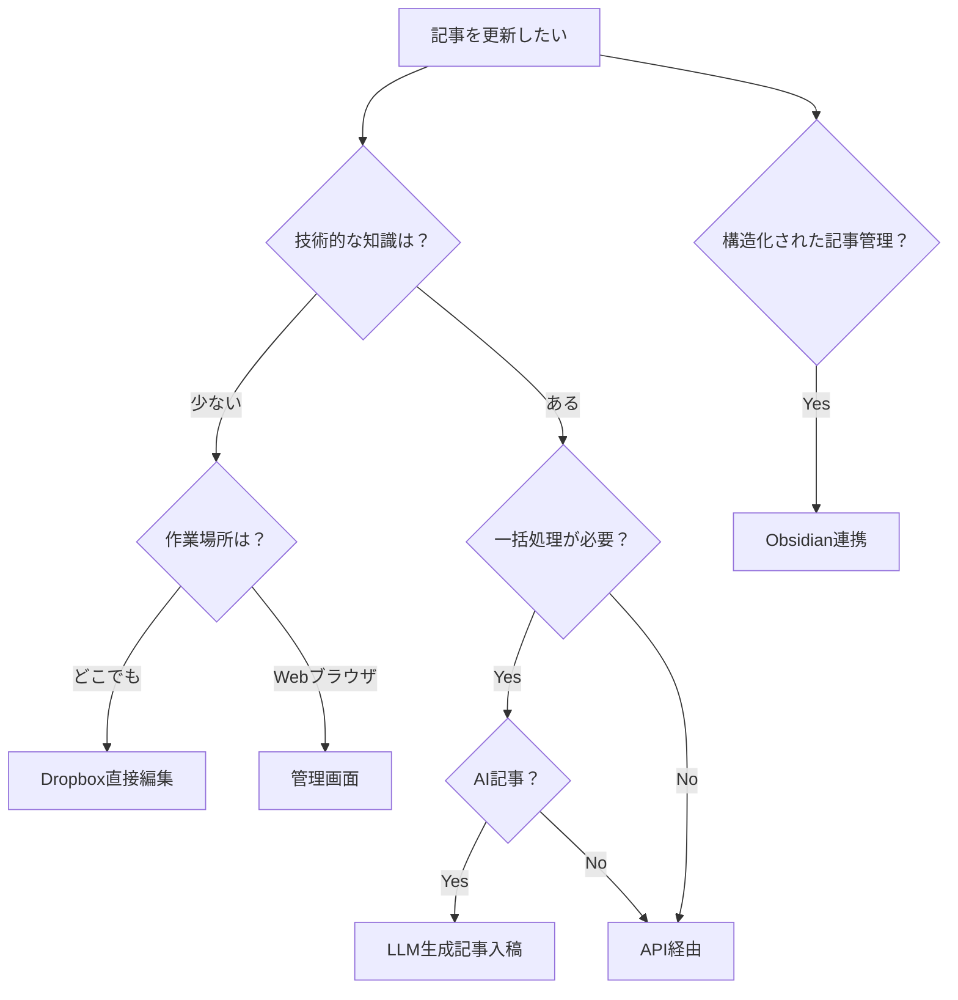

# tobelog - 個人ブログシステム

[](https://github.com/junichiro/tobelog/actions/workflows/ci-cd.yml)
[](https://github.com/junichiro/tobelog/actions/workflows/security.yml)

## 概要

`tobelog`は、Dropboxをメインストレージとして活用するRust製の個人ブログシステムです。個人利用に最適化されており、Markdown形式での記事管理とLLM生成記事の入稿に対応しています。

### 特徴

- **Dropboxストレージ連携**: 記事とメディアファイルをDropboxで管理
- **Markdown記事管理**: pulldown-cmarkによる高速Markdown処理
- **LLM生成記事対応**: AI生成コンテンツの簡単入稿
- **レスポンシブデザイン**: モバイル・デスクトップ対応
- **SSL/TLS対応**: Let's EncryptとnginxによるHTTPS化
- **Docker対応**: 開発・本番環境の統一
- **systemd連携**: システムサービスとしての安定運用
- **パフォーマンス最適化**: キャッシュシステムとパフォーマンス監視

## 記事更新方法

本システムでは以下の5つの記事更新方法を提供しています。用途に応じて最適な方法を選択してください。

## 1. Dropbox直接編集

最も簡単で直感的な記事更新方法です。Dropboxクライアントを使用してMarkdownファイルを直接編集できます。

### 特徴
- **簡単**: 技術的な知識不要
- **どこでも**: Dropboxが利用可能な場所なら更新可能
- **リアルタイム**: 編集と同時に自動同期

### 使用方法
1. Dropboxの`/BlogStorage/posts/`フォルダを開く
2. 編集したいMarkdownファイルを選択
3. テキストエディタで編集・保存
4. 自動的にWebサイトに反映

### フォルダ構造
```
/BlogStorage/
├── posts/                    # 公開記事
│   ├── 2024/
│   │   ├── 01-first-post.md
│   │   └── 02-second-post.md
│   └── 2025/
│       └── 01-new-year-post.md
├── drafts/                   # 下書き
│   └── draft-post.md
├── /drafts/                  # 下書きフォルダ（別パス表記）
└── media/                    # メディアファイル
    ├── images/
    │   ├── 2024/
    │   └── 2025/
    └── videos/
```

### 📊 方法別比較表

| 方法 | 技術レベル | 作業場所 | 一括処理 | オフライン | 推奨用途 |
|------|------------|----------|----------|------------|----------|
| **Dropbox直接編集** | 低 | どこでも | ❌ | ⚠️ | 日常的な記事編集 |
| **管理画面（Admin UI）** | 低 | Webブラウザ | ❌ | ❌ | 簡単な記事作成・編集 |
| **API経由** | 高 | 任意 | ✅ | ✅ | 自動化・外部ツール連携 |
| **LLM生成記事入稿** | 中 | Webブラウザ | ✅ | ❌ | AI記事の一括処理 |
| **Obsidian連携** | 中 | Obsidian | ❌ | ✅ | 構造化された記事管理 |

### 🤔 どの方法を選ぶべきか？



詳細なマニュアルは [記事更新マニュアル](docs/article-update-manual.md) を参照してください。

## 2. 管理画面（Admin UI）

Webブラウザから直感的に記事を作成・編集できる方法です。

### 特徴
- **簡単**: Webフォームで記事作成
- **プレビュー**: リアルタイムプレビュー機能
- **メディア管理**: 画像アップロード機能

### 使用方法
1. `http://localhost:3000/admin` にアクセス
2. 「新規記事作成」をクリック
3. タイトル、内容、メタデータを入力
4. 「投稿」ボタンで公開

## 3. API経由

プログラムから記事を操作する方法です。自動化や外部ツール連携に最適です。

### 特徴
- **自動化**: スクリプトによる一括処理
- **外部連携**: CMS、ツール連携
- **高速**: 大量記事の処理

## 4. LLM生成記事入稿

AIで生成した記事を効率的に入稿する方法です。

### 特徴
- **AI連携**: GPT、Claude等のLLM出力を直接処理
- **一括処理**: 複数記事を同時に処理
- **メタデータ自動生成**: タイトルやタグの自動抽出

## 5. Obsidian連携

Obsidian等のMarkdownエディタとの連携方法です。

### 特徴
- **構造化**: リンク、タグ機能活用
- **オフライン**: ネット環境不要
- **高機能**: 高度なMarkdown編集

## 技術スタック

### バックエンド
- **言語**: Rust (2021 Edition)
- **Webフレームワーク**: Axum
- **データベース**: SQLite (SQLxによるORM)
- **テンプレートエンジン**: Tera
- **Markdown処理**: pulldown-cmark

### フロントエンド
- **スタイリング**: TailwindCSS
- **レスポンシブデザイン**: モバイルファースト

### インフラ
- **コンテナ**: Docker & Docker Compose
- **リバースプロキシ**: nginx
- **SSL証明書**: Let's Encrypt (certbot)
- **サービス管理**: systemd
- **CI/CD**: GitHub Actions

## セットアップ

### 必要な環境

- Rust 1.70+
- Docker & Docker Compose
- SQLite3
- Dropbox API アクセストークン

### 1. 環境変数の設定

```bash
cp .env.example .env
```

`.env`ファイルを編集して必要な環境変数を設定：

```env
# サーバー設定
SERVER_HOST=0.0.0.0
SERVER_PORT=3000

# データベース
DATABASE_URL=sqlite://blog.db

# Dropbox API
DROPBOX_ACCESS_TOKEN=your_dropbox_token_here

# セキュリティ
API_KEY=your_secure_api_key_here

# ブログ設定
BLOG_TITLE=My Personal Blog
```

### 2. Dropbox App設定

1. [Dropbox App Console](https://www.dropbox.com/developers/apps)で新規アプリを作成
2. Permission設定: `files.content.read`, `files.content.write`
3. アクセストークンを取得して環境変数に設定

### 3. 開発環境での起動

```bash
# 依存関係のインストール
cargo build

# データベースの初期化
cargo run --bin test_markdown_database

# Dropboxフォルダ構造の作成
cargo run --bin test_dropbox

# サーバーの起動
cargo run
```

ブラウザで `http://localhost:3000` にアクセス

### 4. Docker環境での起動

```bash
# 開発環境
docker-compose up -d

# 本番環境
docker-compose -f docker-compose.yml -f docker-compose.production.yml up -d
```

## 使用方法

### 記事の作成・投稿

#### メタデータの詳細説明

全ての記事は、Markdownファイルの先頭にYAMLフロントマターでメタデータを記述する必要があります。

##### 必須フィールド

```yaml
---
title: "記事のタイトル"              # 記事タイトル（必須）
created_at: "2025-01-01T00:00:00Z"  # 作成日時（ISO 8601形式）
published: true                      # 公開状態（true/false）
---
```

##### 任意フィールド

以下のフィールドを使用できます：
- `title`: 記事タイトル（必須）
- `created_at`: 作成日時（必須、ISO 8601形式）
- `updated_at`: 更新日時（自動設定）
- `category`: カテゴリ（文字列）
- `tags`: タグ（文字列配列）
- `published`: 公開状態（true/false、必須）
- `featured`: 注目記事フラグ（true/false）
- `excerpt`: 記事の要約文（自動生成可能）
- `author`: 執筆者名
- `slug`: カスタムURL（自動生成可能）

```yaml
---
title: "記事のタイトル"
created_at: "2025-01-01T00:00:00Z"
updated_at: "2025-01-02T12:00:00Z"  # 更新日時（自動設定）
category: "tech"                     # カテゴリ（文字列）
tags: ["rust", "blog", "tutorial"]  # タグ（文字列配列）
published: true                      # 公開状態
featured: false                      # 注目記事フラグ
excerpt: "記事の要約文"               # 記事の要約（自動生成可能）
author: "ブログ執筆者"                # 執筆者名
slug: "custom-url-slug"              # カスタムURL（自動生成可能）
---
```

##### 完全な例

```yaml
---
title: "Rustでブログシステムを構築する完全ガイド"
created_at: "2025-01-15T09:00:00Z"
updated_at: "2025-01-16T14:30:00Z"
category: "tech"
tags: ["rust", "web", "blog", "tutorial"]
published: true
featured: true
excerpt: "Rustを使って高性能なブログシステムを構築する方法を詳しく解説します。"
author: "技術ブログ編集部"
slug: "rust-blog-system-guide"
---

# Rustでブログシステムを構築する

この記事では、Rustを使って高性能なブログシステムを構築する方法を説明します。

## はじめに

Rustは...
```

#### 手動投稿ワークフロー

1. Markdownファイルを作成（フロントマター必須）：

```markdown
---
title: "記事タイトル"
created_at: "2025-01-01T00:00:00Z"
category: "tech"
tags: ["rust", "blog"]
published: true
---

# 記事本文

ここに記事の内容を書きます。
```

2. Dropboxにアップロード：

```bash
cargo run --bin upload_to_dropbox article.md
```

3. データベースと同期：

```bash
cargo run --bin sync_dropbox_to_db
```

#### API経由での投稿

```bash
# 記事一覧の取得
curl http://localhost:3000/api/posts

# APIエンドポイント一覧
GET /api/posts              # 記事一覧取得
POST /api/posts             # 記事作成
PUT /api/posts/{slug}       # 記事更新
DELETE /api/posts/{slug}    # 記事削除
POST /api/sync/dropbox      # Dropbox同期

# 新規記事の作成
curl -X POST http://localhost:3000/api/posts \
  -H "Content-Type: application/json" \
  -H "Authorization: Bearer YOUR_API_KEY" \
  -d '{
    "title": "新しい記事",
    "content": "記事の内容",
    "category": "tech",
    "tags": ["rust"],
    "published": true
  }'
```

#### Pythonでの操作例

```python
import requests
import json
from datetime import datetime

# APIクライアントクラス
class ToBelogClient:
    def __init__(self, base_url, api_key):
        self.base_url = base_url.rstrip('/')
        self.api_key = api_key
        self.headers = {
            'Authorization': f'Bearer {api_key}',
            'Content-Type': 'application/json'
        }
    
    def get_posts(self, limit=10, offset=0):
        """記事一覧を取得"""
        url = f"{self.base_url}/api/posts"
        params = {'limit': limit, 'offset': offset}
        response = requests.get(url, params=params)
        return response.json()
    
    def create_post(self, title, content, category=None, tags=None, published=True):
        """新規記事を作成"""
        url = f"{self.base_url}/api/posts"
        data = {
            'title': title,
            'content': content,
            'category': category,
            'tags': tags or [],
            'published': published,
            'created_at': datetime.now().isoformat()
        }
        response = requests.post(url, headers=self.headers, json=data)
        return response.json()
    
    def update_post(self, slug, title=None, content=None, category=None, tags=None, published=None):
        """記事を更新"""
        url = f"{self.base_url}/api/posts/{slug}"
        data = {}
        if title is not None:
            data['title'] = title
        if content is not None:
            data['content'] = content
        if category is not None:
            data['category'] = category
        if tags is not None:
            data['tags'] = tags
        if published is not None:
            data['published'] = published
        
        response = requests.put(url, headers=self.headers, json=data)
        return response.json()
    
    def delete_post(self, slug):
        """記事を削除"""
        url = f"{self.base_url}/api/posts/{slug}"
        response = requests.delete(url, headers=self.headers)
        return response.json()
    
    def sync_dropbox(self):
        """Dropboxと同期"""
        url = f"{self.base_url}/api/sync/dropbox"
        response = requests.post(url, headers=self.headers)
        return response.json()

# 使用例
client = ToBelogClient('http://localhost:3000', 'your_api_key_here')

# 記事一覧を取得
posts = client.get_posts(limit=5)
print(f"取得した記事数: {len(posts.get('data', []))}")

# 新規記事を作成
new_post = client.create_post(
    title="PythonからのAPI投稿テスト",
    content="# テスト記事\n\nPython APIクライアントからの投稿テストです。",
    category="tech",
    tags=["python", "api", "test"]
)
print(f"作成した記事: {new_post}")

# 記事を更新
updated_post = client.update_post(
    slug="python-api-test",
    title="更新されたタイトル",
    published=True
)
print(f"更新結果: {updated_post}")

# Dropboxと同期
sync_result = client.sync_dropbox()
print(f"同期結果: {sync_result}")
```

### 管理画面

`http://localhost:3000/admin` で管理画面にアクセス可能です。

- 記事の作成・編集・削除
- メディアファイルの管理
- サイト統計の確認

## API エンドポイント

詳細なAPI仕様書は [docs/api-specification.md](docs/api-specification.md) を参照してください。

### 主要エンドポイント

| メソッド | エンドポイント | 説明 | 認証 |
|---------|-------------|------|------|
| GET | `/` | ホームページ（記事一覧） | 不要 |
| GET | `/posts/{year}/{slug}` | 個別記事表示 | 不要 |
| GET | `/category/{category}` | カテゴリ別記事一覧 | 不要 |
| GET | `/tag/{tag}` | タグ別記事一覧 | 不要 |
| GET | `/api/posts` | 記事一覧API | 不要 |
| GET | `/api/posts/{slug}` | 個別記事API | 不要 |
| POST | `/api/posts` | 記事作成 | API Key |
| PUT | `/api/posts/{slug}` | 記事更新 | API Key |
| DELETE | `/api/posts/{slug}` | 記事削除 | API Key |
| POST | `/api/sync/dropbox` | Dropbox同期 | API Key |
| POST | `/api/import/markdown` | Markdown一括インポート | API Key |
| POST | `/api/import/llm-article` | LLM記事一括インポート | API Key |
| GET | `/admin` | 管理画面 | 不要 |
| GET | `/admin/new` | 新規記事作成 | 不要 |
| GET | `/admin/edit/{slug}` | 記事編集 | 不要 |
| GET | `/health` | ヘルスチェック | 不要 |
| GET | `/api/health` | APIヘルスチェック | 不要 |

### 認証方法

APIキーを使用した認証が必要なエンドポイントでは、以下のヘッダーを追加してください：

```http
Authorization: Bearer YOUR_API_KEY
```

### リクエスト例

記事作成のリクエスト例：

```javascript
// JavaScript/Node.js での API呼び出し例
const response = await fetch('http://localhost:3000/api/posts', {
  method: 'POST',
  headers: {
    'Content-Type': 'application/json',
    'Authorization': 'Bearer your_api_key_here'
  },
  body: JSON.stringify({
    title: 'JavaScript からの投稿',
    content: '# テスト記事\n\nJavaScript API クライアントからの投稿です。',
    category: 'tech',
    tags: ['javascript', 'api'],
    published: true
  })
});

const result = await response.json();
console.log('投稿結果:', result);
```

### レスポンス形式

全てのAPIレスポンスはJSON形式で返されます：

```json
{
  "status": "success",
  "data": {
    // レスポンスデータ
  },
  "message": "操作が成功しました"
}
```

エラーレスポンス：

```json
{
  "status": "error",
  "error": {
    "code": "VALIDATION_ERROR",
    "message": "入力データに誤りがあります"
  }
}
```

## デプロイ

本番環境へのデプロイには複数の方法があります。最適な方法を選択するため、**[📋 統一デプロイガイド](DEPLOYMENT.md)** を参照してください。

### 🚀 クイックスタート（15分）

**初心者推奨**: Docker Composeで即座に本番環境を構築

```bash
# 1. 環境設定
cp .env.example .env
nano .env  # DROPBOX_ACCESS_TOKEN、ドメイン名を設定

# 2. 本番環境起動
docker-compose -f docker-compose.yml -f docker-compose.production.yml up -d
```

### 📚 詳細デプロイ方法

用途に応じて最適な方法を選択：

| 環境 | 推奨方法 | 特徴 | ガイド |
|------|----------|------|--------|
| **個人ブログ** | Docker Compose | 簡単・SSL自動化 | [DEPLOYMENT.md](DEPLOYMENT.md) |
| **小規模チーム** | systemd | 軽量・カスタマイズ性 | [SYSTEMD.md](SYSTEMD.md) |
| **企業環境** | systemd + CI/CD | 自動化・高信頼性 | [SYSTEMD.md](SYSTEMD.md) |

### 🔧 部分的な設定例

```bash
# SSL証明書の手動設定（必要に応じて）
sudo certbot certonly --standalone -d your-domain.com

# systemdサービス設定（軽量運用の場合）
sudo ./scripts/install-systemd.sh
sudo systemctl enable tobelog
```

**詳細な手順・トラブルシューティング**: [DEPLOYMENT.md](DEPLOYMENT.md) を参照

## 開発

### テストの実行

```bash
# 全テストの実行
cargo test

# SSL設定テスト
cargo test ssl_config_test

# CI/CD設定テスト
cargo test cicd_config_test
```

### コード品質チェック

```bash
# フォーマット確認
cargo fmt --check

# Clippy実行
cargo clippy -- -D warnings

# セキュリティ監査
cargo audit
```

### 設定ファイル

- [開発環境設定](DEVELOPMENT.md)
- [Docker設定](DOCKER.md)
- [systemd設定](SYSTEMD.md)
- [プロジェクト仕様](CLAUDE.md)

## パフォーマンス

- **起動時間**: 3秒以内
- **メモリ使用量**: 50MB以下（アイドル時）
- **記事表示**: 100ms以下
- **API応答**: 50ms以下

## セキュリティ

- HTTPS強制（Let's Encrypt）
- セキュリティヘッダー設定
- Rate Limiting
- API Key認証
- 依存関係の脆弱性監視

## ライセンス

MIT License

## コントリビューション

1. Issue作成
2. Feature branchを作成
3. 変更を実装
4. テストを追加
5. Pull Requestを作成

## よくある質問（FAQ）

### Q: 記事が表示されない場合の対処方法は？

**A:** 以下の順序で確認してください：

1. **フロントマターの確認**
   ```yaml
   ---
   title: "記事タイトル"
   created_at: "2025-01-01T00:00:00Z"
   published: true  # ←これがfalseになっていませんか？
   ---
   ```

2. **Dropbox同期の実行**
   ```bash
   cargo run --bin sync_dropbox_to_db
   ```

3. **ファイルパスの確認**
   - ファイルが正しく `/BlogStorage/posts/年/ファイル名.md` の形式になっているか
   - ファイル名に日本語や特殊文字が含まれていないか

4. **サーバーログの確認**
   ```bash
   # 開発環境
   cargo run
   
   # Docker環境
   docker-compose logs tobelog
   ```

### Q: Dropboxとの同期がうまくいかない場合は？

**A:** 以下を確認してください：

1. **アクセストークンの確認**
   ```bash
   # .envファイルでトークンが正しく設定されているか確認
   grep DROPBOX_ACCESS_TOKEN .env
   ```

2. **Dropboxアプリの権限確認**
   - [Dropbox App Console](https://www.dropbox.com/developers/apps)で権限を確認
   - `files.content.read`、`files.content.write`が有効になっているか

3. **フォルダ構造の確認**
   ```bash
   # テストコマンドでフォルダ構造を確認
   cargo run --bin test_dropbox
   ```

### Q: 管理画面にアクセスできない場合は？

**A:** 以下を確認してください：

1. **サーバーが起動しているか**
   ```bash
   curl http://localhost:3000/health
   ```

2. **ポート番号の確認**
   - デフォルトは3000番ポート
   - 環境変数`SERVER_PORT`で変更可能

3. **ファイアウォール設定**
   - ローカル開発環境では不要
   - 本番環境では適切なポート開放が必要

### Q: APIキーの設定方法は？

**A:** 以下の手順で設定してください：

1. **環境変数の設定**
   ```bash
   echo "API_KEY=your_secure_random_key_here" >> .env
   ```

2. **APIキーの生成**
   ```bash
   # ランダムなAPIキーを生成
   openssl rand -hex 32
   ```

3. **API呼び出し時の認証**
   ```bash
   curl -H "Authorization: Bearer your_api_key" http://localhost:3000/api/posts
   ```

### Q: 本番環境でのSSL証明書の設定方法は？

**A:** Let's Encryptを使用した自動化設定を推奨します：

1. **Docker Composeでの自動設定**
   ```bash
   # 本番環境用の構成で起動
   docker-compose -f docker-compose.yml -f docker-compose.production.yml up -d
   ```

2. **手動設定**
   ```bash
   # certbotでSSL証明書を取得
   sudo certbot certonly --standalone -d your-domain.com
   ```

詳細は [DEPLOYMENT.md](DEPLOYMENT.md) を参照してください。

### Q: どの更新方法が一番おすすめですか？

**A:** 用途に応じて以下のように選択してください：

- **日常的な記事編集**: Dropbox直接編集（技術知識不要）
- **リッチな編集体験**: 管理画面（プレビュー機能あり）  
- **自動化・大量処理**: API経由（プログラム制御）
- **AI記事作成**: LLM生成記事入稿（GPT/Claude連携）
- **高度な記事管理**: Obsidian連携（構造化・リンク機能）

初心者には **Dropbox直接編集** 、プログラマーには **API経由** がおすすめです。

### Q: 記事が反映されません

**A:** 以下を順番に確認してください：

1. フロントマターで `published: true` になっているか
2. Dropbox同期が実行されているか（`cargo run --bin sync_dropbox_to_db`）
3. ファイルパスが正しいか（`/BlogStorage/posts/年/ファイル名.md`）
4. サーバーが正常に動作しているか

### Q: 画像が表示されません

**A:** 以下を確認してください：

1. **画像ファイルの配置場所**
   ```
   /BlogStorage/media/images/年/画像ファイル名
   ```

2. **Markdownでの画像参照**
   ```markdown
   
   ```

3. **画像ファイル形式**
   - 対応形式: JPG, PNG, GIF, WebP
   - ファイルサイズ: 10MB以下推奨

4. **Dropbox同期の確認**
   ```bash
   cargo run --bin sync_dropbox_to_db
   ```

### Q: 記事の一括インポート方法は？

**A:** 以下の方法があります：

1. **Markdownファイルの一括インポート**
   ```bash
   # 管理画面からの一括インポート
   # http://localhost:3000/admin/import
   ```

2. **API経由での一括インポート**
   ```bash
   curl -X POST http://localhost:3000/api/import/markdown \
     -H "Authorization: Bearer YOUR_API_KEY" \
     -F "files=@article1.md" \
     -F "files=@article2.md"
   ```

3. **Dropboxフォルダに直接配置**
   ```bash
   # ファイルをDropboxに配置後、同期実行
   cargo run --bin sync_dropbox_to_db
   ```

## トラブルシューティング

### 記事が表示されない

**症状**: 記事をアップロードしたが、Webサイトに表示されない

**原因と対処法**:
1. **published: false** - フロントマターで公開設定を確認
2. **同期未実行** - `cargo run --bin sync_dropbox_to_db`を実行
3. **ファイル名の問題** - 日本語や特殊文字を避ける
4. **パスの問題** - `/BlogStorage/posts/年/ファイル名.md`の形式を確認

### 画像が表示されない

**症状**: 記事内の画像が表示されない

**原因と対処法**:
1. **画像パスの間違い** - `/media/images/年/ファイル名` の形式を確認
2. **画像未アップロード** - Dropboxの `/BlogStorage/media/` にファイルが存在するか確認
3. **ファイル形式の問題** - JPG, PNG, GIF, WebP形式を使用
4. **ファイルサイズ** - 10MB以下に制限

### APIが動作しない

**症状**: API経由での操作でエラーが発生

**原因と対処法**:
1. **APIキー未設定** - `.env`ファイルで`API_KEY`を設定
2. **認証ヘッダーの問題** - `Authorization: Bearer YOUR_API_KEY`の形式を確認
3. **リクエスト形式エラー** - Content-Typeヘッダーを`application/json`に設定
4. **エンドポイントの間違い** - 正しいURLパスを確認

### Dropbox同期エラー

**症状**: Dropboxとの同期時にエラーが発生

**原因と対処法**:
1. **アクセストークンの期限切れ** - 新しいトークンを再発行
2. **権限不足** - Dropboxアプリの権限設定を確認
3. **ネットワークエラー** - インターネット接続を確認
4. **レート制限** - 少し時間をおいてから再試行

### サーバー起動エラー

**症状**: サーバーが起動しない

**原因と対処法**:
1. **ポート競合** - `SERVER_PORT`環境変数で別のポートを指定
2. **データベースエラー** - SQLiteファイルの権限を確認
3. **依存関係の問題** - `cargo build`でビルドエラーを確認

### API認証エラー

**症状**: APIアクセス時に認証エラーが発生

**原因と対処法**:
1. **APIキー未設定** - `.env`ファイルで`API_KEY`を設定
2. **ヘッダー形式エラー** - `Authorization: Bearer YOUR_API_KEY`の形式を確認
3. **キーの不一致** - 設定したAPIキーと送信したキーを照合

### SSL証明書エラー

**症状**: HTTPS接続時にエラーが発生

**原因と対処法**:
1. **証明書期限切れ** - Let's Encryptの証明書を更新
2. **ドメイン不一致** - 証明書のドメインと実際のドメインを確認
3. **nginx設定エラー** - nginx設定ファイルを確認

詳細なトラブルシューティングガイドは [docs/troubleshooting.md](docs/troubleshooting.md) を参照してください。

## サポート

- [GitHub Issues](https://github.com/junichiro/tobelog/issues)
- [開発ガイド](DEVELOPMENT.md)
- [トラブルシューティング](docs/troubleshooting.md)

---

**tobelog** - Simple, secure, and scalable personal blogging with Rust & Dropbox
