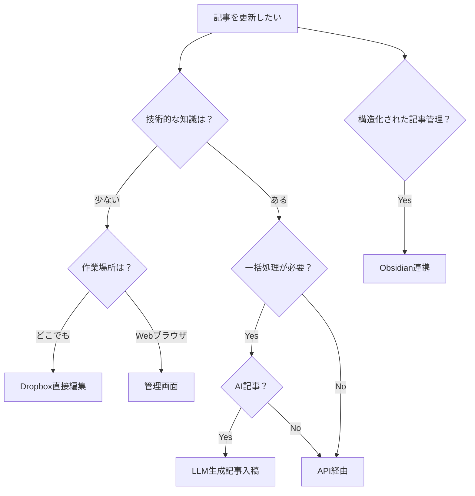

# tobelog - 個人ブログシステム

[](https://github.com/junichiro/tobelog/actions/workflows/ci-cd.yml)
[](https://github.com/junichiro/tobelog/actions/workflows/security.yml)

## 概要

`tobelog`は、Dropboxをメインストレージとして活用するRust製の個人ブログシステムです。個人利用に最適化されており、Markdown形式での記事管理とLLM生成記事の入稿に対応しています。

### 特徴

- **Dropboxストレージ連携**: 記事とメディアファイルをDropboxで管理
- **Markdown記事管理**: pulldown-cmarkによる高速Markdown処理
- **LLM生成記事対応**: AI生成コンテンツの簡単入稿
- **レスポンシブデザイン**: モバイル・デスクトップ対応
- **SSL/TLS対応**: Let's EncryptとnginxによるHTTPS化
- **Docker対応**: 開発・本番環境の統一
- **systemd連携**: システムサービスとしての安定運用
- **パフォーマンス最適化**: キャッシュシステムとパフォーマンス監視

## 記事更新方法

本システムでは以下の5つの記事更新方法を提供しています。用途に応じて最適な方法を選択してください。

### 📊 方法別比較表

| 方法 | 技術レベル | 作業場所 | 一括処理 | オフライン | 推奨用途 |
|------|------------|----------|----------|------------|----------|
| **Dropbox直接編集** | 低 | どこでも | ❌ | ⚠️ | 日常的な記事編集 |
| **管理画面（Admin UI）** | 低 | Webブラウザ | ❌ | ❌ | 簡単な記事作成・編集 |
| **API経由** | 高 | 任意 | ✅ | ✅ | 自動化・外部ツール連携 |
| **LLM生成記事入稿** | 中 | Webブラウザ | ✅ | ❌ | AI記事の一括処理 |
| **Obsidian連携** | 中 | Obsidian | ❌ | ✅ | 構造化された記事管理 |

### 🤔 どの方法を選ぶべきか？



詳細なマニュアルは [記事更新マニュアル](docs/article-update-manual.md) を参照してください。

## 技術スタック

### バックエンド
- **言語**: Rust (2021 Edition)
- **Webフレームワーク**: Axum
- **データベース**: SQLite (SQLxによるORM)
- **テンプレートエンジン**: Tera
- **Markdown処理**: pulldown-cmark

### フロントエンド
- **スタイリング**: TailwindCSS
- **レスポンシブデザイン**: モバイルファースト

### インフラ
- **コンテナ**: Docker & Docker Compose
- **リバースプロキシ**: nginx
- **SSL証明書**: Let's Encrypt (certbot)
- **サービス管理**: systemd
- **CI/CD**: GitHub Actions

## セットアップ

### 必要な環境

- Rust 1.70+
- Docker & Docker Compose
- SQLite3
- Dropbox API アクセストークン

### 1. 環境変数の設定

```bash
cp .env.example .env
```

`.env`ファイルを編集して必要な環境変数を設定：

```env
# サーバー設定
SERVER_HOST=0.0.0.0
SERVER_PORT=3000

# データベース
DATABASE_URL=sqlite://blog.db

# Dropbox API
DROPBOX_ACCESS_TOKEN=your_dropbox_token_here

# セキュリティ
API_KEY=your_secure_api_key_here

# ブログ設定
BLOG_TITLE=My Personal Blog
```

### 2. Dropbox App設定

1. [Dropbox App Console](https://www.dropbox.com/developers/apps)で新規アプリを作成
2. Permission設定: `files.content.read`, `files.content.write`
3. アクセストークンを取得して環境変数に設定

### 3. 開発環境での起動

```bash
# 依存関係のインストール
cargo build

# データベースの初期化
cargo run --bin test_markdown_database

# Dropboxフォルダ構造の作成
cargo run --bin test_dropbox

# サーバーの起動
cargo run
```

ブラウザで `http://localhost:3000` にアクセス

### 4. Docker環境での起動

```bash
# 開発環境
docker-compose up -d

# 本番環境
docker-compose -f docker-compose.yml -f docker-compose.production.yml up -d
```

## 使用方法

### 記事の作成・投稿

#### 手動投稿ワークフロー

1. Markdownファイルを作成（フロントマター必須）：

```markdown
---
title: "記事タイトル"
created_at: "2025-01-01T00:00:00Z"
category: "tech"
tags: ["rust", "blog"]
published: true
---

# 記事本文

ここに記事の内容を書きます。
```

2. Dropboxにアップロード：

```bash
cargo run --bin upload_to_dropbox article.md
```

3. データベースと同期：

```bash
cargo run --bin sync_dropbox_to_db
```

#### API経由での投稿

```bash
# 記事一覧の取得
curl http://localhost:3000/api/posts

# 新規記事の作成
curl -X POST http://localhost:3000/api/posts \
  -H "Content-Type: application/json" \
  -H "Authorization: Bearer YOUR_API_KEY" \
  -d '{
    "title": "新しい記事",
    "content": "記事の内容",
    "category": "tech",
    "tags": ["rust"],
    "published": true
  }'
```

### 管理画面

`http://localhost:3000/admin` で管理画面にアクセス可能です。

- 記事の作成・編集・削除
- メディアファイルの管理
- サイト統計の確認

## API仕様

詳細なAPI仕様書は [docs/api-specification.md](docs/api-specification.md) を参照してください。

### 主要エンドポイント

| メソッド | エンドポイント | 説明 |
|---------|-------------|------|
| GET | `/` | ホームページ（記事一覧） |
| GET | `/posts/{year}/{slug}` | 個別記事表示 |
| GET | `/api/posts` | 記事一覧API |
| POST | `/api/posts` | 記事作成 |
| PUT | `/api/posts/{slug}` | 記事更新 |
| DELETE | `/api/posts/{slug}` | 記事削除 |
| GET | `/admin` | 管理画面 |
| GET | `/health` | ヘルスチェック |

## デプロイ

本番環境へのデプロイには複数の方法があります。最適な方法を選択するため、**[📋 統一デプロイガイド](DEPLOYMENT.md)** を参照してください。

### 🚀 クイックスタート（15分）

**初心者推奨**: Docker Composeで即座に本番環境を構築

```bash
# 1. 環境設定
cp .env.example .env
nano .env  # DROPBOX_ACCESS_TOKEN、ドメイン名を設定

# 2. 本番環境起動
docker-compose -f docker-compose.yml -f docker-compose.production.yml up -d
```

### 📚 詳細デプロイ方法

用途に応じて最適な方法を選択：

| 環境 | 推奨方法 | 特徴 | ガイド |
|------|----------|------|--------|
| **個人ブログ** | Docker Compose | 簡単・SSL自動化 | [DEPLOYMENT.md](DEPLOYMENT.md) |
| **小規模チーム** | systemd | 軽量・カスタマイズ性 | [SYSTEMD.md](SYSTEMD.md) |
| **企業環境** | systemd + CI/CD | 自動化・高信頼性 | [SYSTEMD.md](SYSTEMD.md) |

### 🔧 部分的な設定例

```bash
# SSL証明書の手動設定（必要に応じて）
sudo certbot certonly --standalone -d your-domain.com

# systemdサービス設定（軽量運用の場合）
sudo ./scripts/install-systemd.sh
sudo systemctl enable tobelog
```

**詳細な手順・トラブルシューティング**: [DEPLOYMENT.md](DEPLOYMENT.md) を参照

## 開発

### テストの実行

```bash
# 全テストの実行
cargo test

# SSL設定テスト
cargo test ssl_config_test

# CI/CD設定テスト
cargo test cicd_config_test
```

### コード品質チェック

```bash
# フォーマット確認
cargo fmt --check

# Clippy実行
cargo clippy -- -D warnings

# セキュリティ監査
cargo audit
```

### 設定ファイル

- [開発環境設定](DEVELOPMENT.md)
- [Docker設定](DOCKER.md)
- [systemd設定](SYSTEMD.md)
- [プロジェクト仕様](CLAUDE.md)

## パフォーマンス

- **起動時間**: 3秒以内
- **メモリ使用量**: 50MB以下（アイドル時）
- **記事表示**: 100ms以下
- **API応答**: 50ms以下

## セキュリティ

- HTTPS強制（Let's Encrypt）
- セキュリティヘッダー設定
- Rate Limiting
- API Key認証
- 依存関係の脆弱性監視

## ライセンス

MIT License

## コントリビューション

1. Issue作成
2. Feature branchを作成
3. 変更を実装
4. テストを追加
5. Pull Requestを作成

## サポート

- [GitHub Issues](https://github.com/junichiro/tobelog/issues)
- [開発ガイド](DEVELOPMENT.md)
- [トラブルシューティング](docs/troubleshooting.md)

---

**tobelog** - Simple, secure, and scalable personal blogging with Rust & Dropbox
